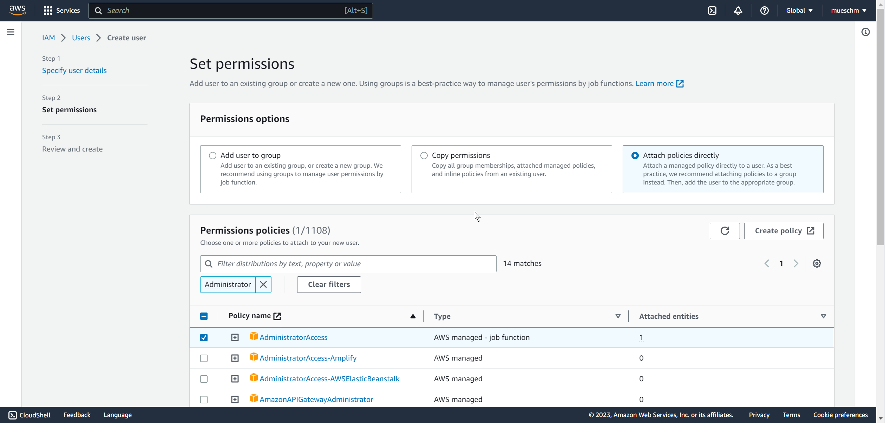
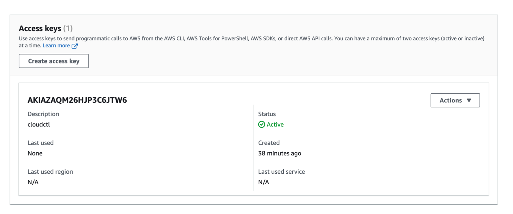
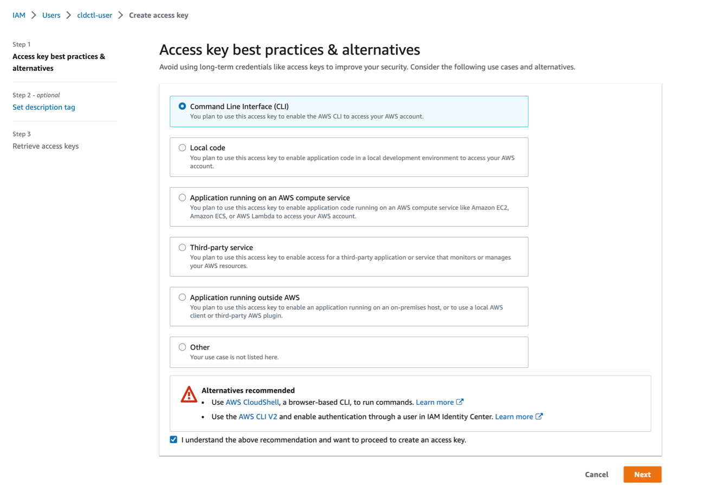
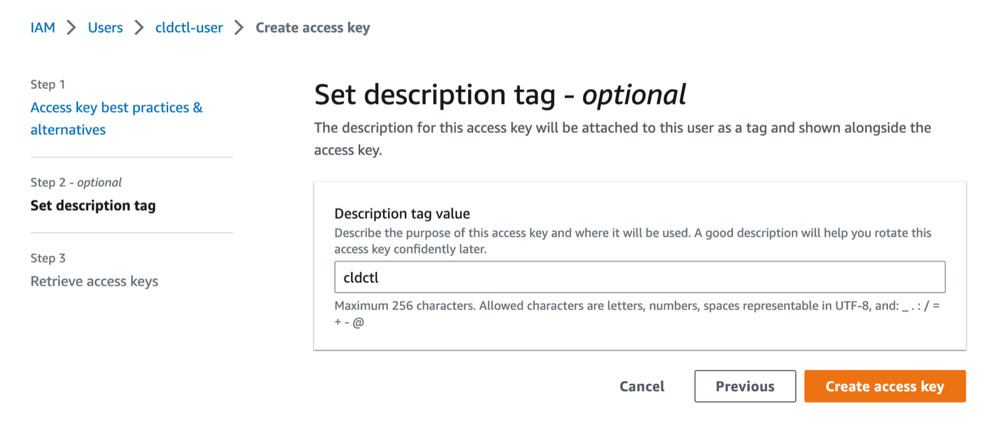
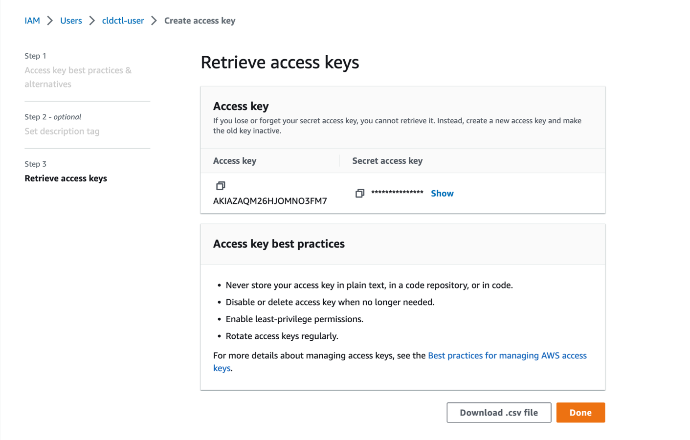

# ArcCtl - AWS Provider

## Authentication

### Create IAM user

For AWS, we’ll need to create a new IAM user and generate an access key. From the
[IAM page](https://us-east-1.console.aws.amazon.com/iamv2/home?region=us-east-1#/users)
of the web console, click the `Add users` button. Give the user a meaningful name click
the `Next` button.

Under `Permissions Options` select `Attach Policy Directly`. Then under `Permission Policies`
search for `AdministratorAccess` and check it off.

Continue to click `Next` accepting the defaults until the account is created.

### Generate access keys

You now have a new IAM user with the appropriate permissions. The last step is to generate
the access key. Click on the `Security credentials` tab, scroll to the `Access keys` section,
and click the `Create access key` button.

On the next screen, select the radio button next to `Command Line Interface (CLI)`, scroll to
the bottom of the screen and check the box to accept the recommendations, and click the `Next`
button.

Give the key a descriptive name, and click the `Create access key` button.

From here, you can click the button to copy the key directly to your clipboard or download it
in a `.csv` file. You’ll use this key to register your AWS provider.

## Supported resources

- [x] [`region`](../../%40resources/region/)
- [x] [`vpc`](../../%40resources/vpc/)
- [x] [`nodeSize`](../../%40resources/nodeSize/)
- [x] [`kubernetesVersion`](../../%40resources/kubernetesVersion/)
- [x] [`kubernetesCluster`](../../%40resources/kubernetesCluster/)
- [x] [`database`](../../%40resources/database/)
- [x] [`databaseSize`](../../%40resources/databaseSize/)
- [x] [`databaseType`](../../%40resources/databaseType/)
- [x] [`databaseVersion`](../../%40resources/databaseVersion/)
- [x] [`dnsZone`](../../%40resources/dnsZone/)
- [x] [`dnsRecord`](../../%40resources/dnsRecord/)
