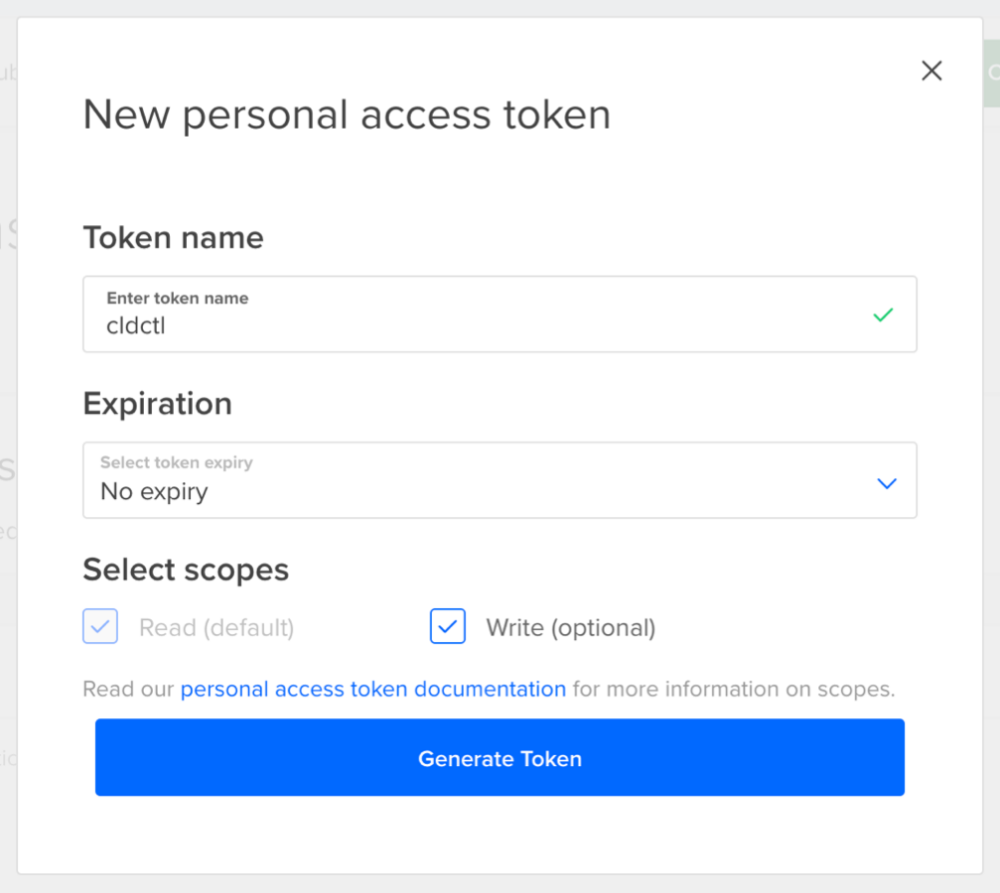

# ArcCtl - Digitalocean Provider

## Authentication

The DigitalOcean provider requires an API token to authenticate. To acquire a token, navigate to the [Api Page](https://cloud.digitalocean.com/account/api/tokens) on the DigitialOcean dashboard and click `Generate New Token`. Enter a useful name, set `Expiration` to `No expiry`, and click the `Generate Token` button.

Once the token is generated it will appear in the list of keys. Copy the token as once you leave this page the token will not be visible again. You’ll use this token to register your Digital Ocean provider.

## Supported resources

- [x] [`region`](../../%40resources/region/)
- [x] [`vpc`](../../%40resources/vpc/)
- [x] [`nodeSize`](../../%40resources/nodeSize/)
- [x] [`kubernetesVersion`](../../%40resources/kubernetesVersion/)
- [x] [`kubernetesCluster`](../../%40resources/kubernetesCluster/)
- [x] [`database`](../../%40resources/database/)
- [x] [`databaseSize`](../../%40resources/databaseSize/)
- [x] [`databaseType`](../../%40resources/databaseType/)
- [x] [`databaseSchema`](../../%40resources/databaseSchema/)
- [x] [`databaseUser`](../../%40resources/databaseUser/)
- [x] [`databaseVersion`](../../%40resources/databaseVersion/)
- [x] [`dnsZone`](../../%40resources/dnsZone/)
- [x] [`dnsRecord`](../../%40resources/dnsRecord/)
