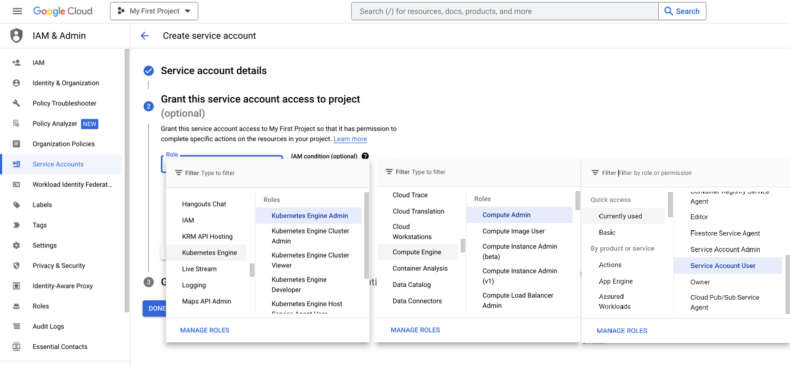
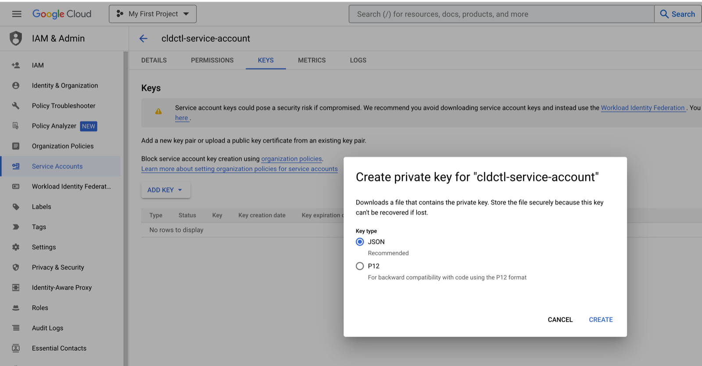
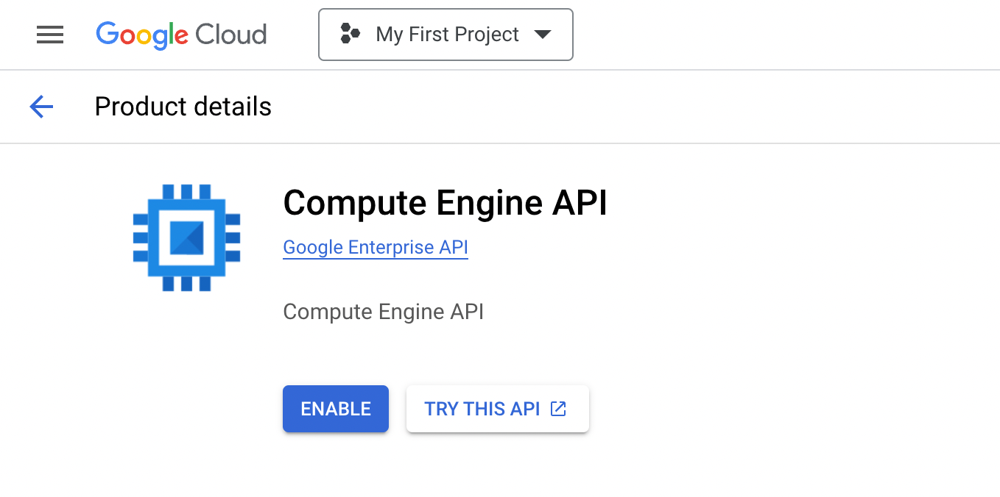

# ArcCtl - Google Cloud Provider

## Authentication

Usage of this provider requires you to create a GCP [service account](https://cloud.google.com/iam/docs/service-account-overview).
Applications use service accounts to make authorized API calls by authenticating as either the
service account itself, or as Google Workspace or Cloud Identity users through domain-wide
delegation. When an application authenticates as a service account, it has access to all resources
that the service account has permission to access.

To create a new service account, go to your [GCP IAM admin page](https://console.cloud.google.com/iam-admin/serviceaccounts) and
follow the steps below:

### 1. Select a project

The first prompt on the service account admin page is for a project. If you have more than one project in your GCP
account, select the one you want to create a service account for.

### 2. Start service account creation

Press the "+ Create Service Account" button in the top toolbar to start the process of creating a new service account

### 3. Grant permissions

You can give your service account permission to do whatever you want, but at minimum you'll need to give it the
`Service Account User` role. Other common permissions include:

- `Compute Admin` - create and manage virtual machines, networking, and most things you need to run cloud applications
- `Kubernetes Engine Admin` - for creating and managing your k8s clusters

### 4. Create a key file

Once your service account is created and you find yourself on the service account's page, click "Keys" on the top toolbar
and then the "Add Key" dropdown button. You'll want to create a new JSON key. The key file should start downloading
automatically when you're done.

### 5. Enable GCP APIs

The final step is to enable the GCP APIs to allow external applications like arcctl to interact with your cloud.
Just like with the service account roles, you'll only have to enable the APIs corresponding to the roles you've given
the service account. Common APIs include:

- [`Compute Engine API`](https://console.cloud.google.com/apis/library/compute.googleapis.com)
- [`Kubernetes Admin API`](https://console.cloud.google.com/apis/library/container.googleapis.com)
- [`Cloud SQL Admin API`](https://console.cloud.google.com/apis/library/sqladmin.googleapis.com)

_Note: this only needs to be done once per project. If you've done this in the past, you won't have to do it again._

## Supported resources

- [x] [`region`](../../%40resources/region/)
- [x] [`vpc`](../../%40resources/vpc/)
- [x] [`kubernetesVersion`](../../%40resources/kubernetesVersion/)
- [x] [`kubernetesCluster`](../../%40resources/kubernetesCluster/)
- [x] [`dnsZone`](../../%40resources/dnsZone/)
- [x] [`dnsRecord`](../../%40resources/dnsRecord/)
- [x] [`databaseSize`](../../%40resources/databaseSize/)
- [x] [`databaseType`](../../%40resources/databaseType/)
- [x] [`databaseVersion`](../../%40resources/databaseVersion/)
- [x] [`database`](../../%40resources/database/)
- [x] [`nodeSize`](../../%40resources/nodeSize/)
